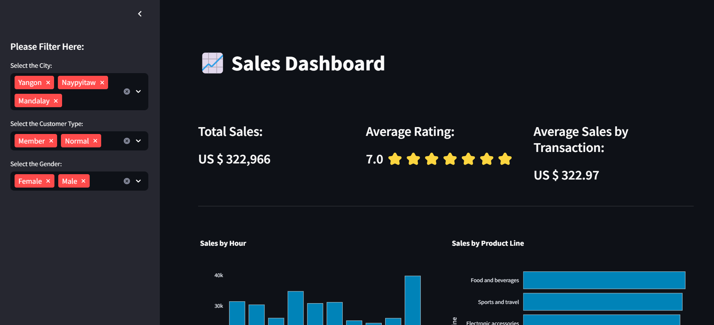
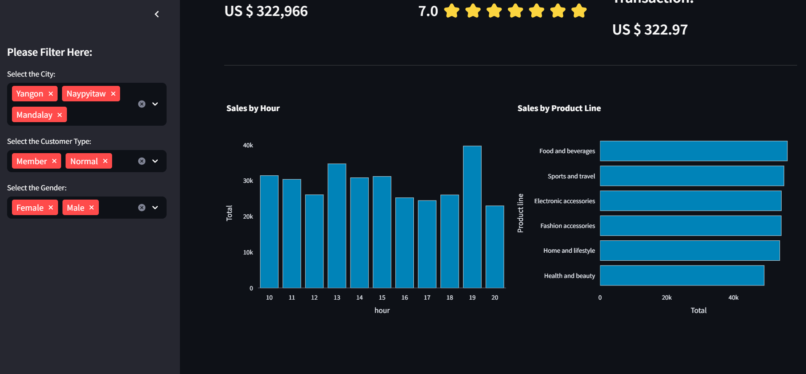

# 📊 Sales Dashboard

## 📝 Description
A **dynamic and interactive Sales Dashboard** built using **Streamlit** and **Plotly**, designed to visualize sales data effectively. This dashboard allows users to filter, analyze, and gain insights from sales data using **charts, graphs, and KPIs**.

---

### 📌 Dashboard Overview

### 📌 Sales Trends

---

## ✨ Features
- 📈 **Interactive sales visualizations with Plotly**
- 🔍 **Filter sales data by date, region, category, etc.**
- ⚡ **Fast and efficient data processing**
- 🎨 **User-friendly UI with Streamlit**

---

## 🚀 Installation & Setup

### **1️⃣ Clone the repository**

git clone https://github.com/RNA62831/Sales-Dashboard/
cd Sales-Dashboard

### **2️⃣ Install dependencies**

pip install -r requirements.txt

### **3️⃣ Run the app**

streamlit run main.py

### 🛠 Technologies Used
Python 🐍
Streamlit 📊
Plotly 📈
Pandas 📝
